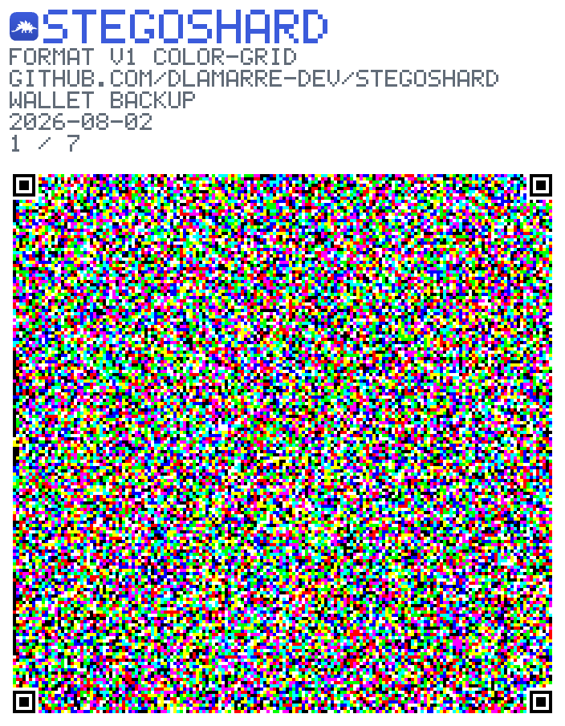
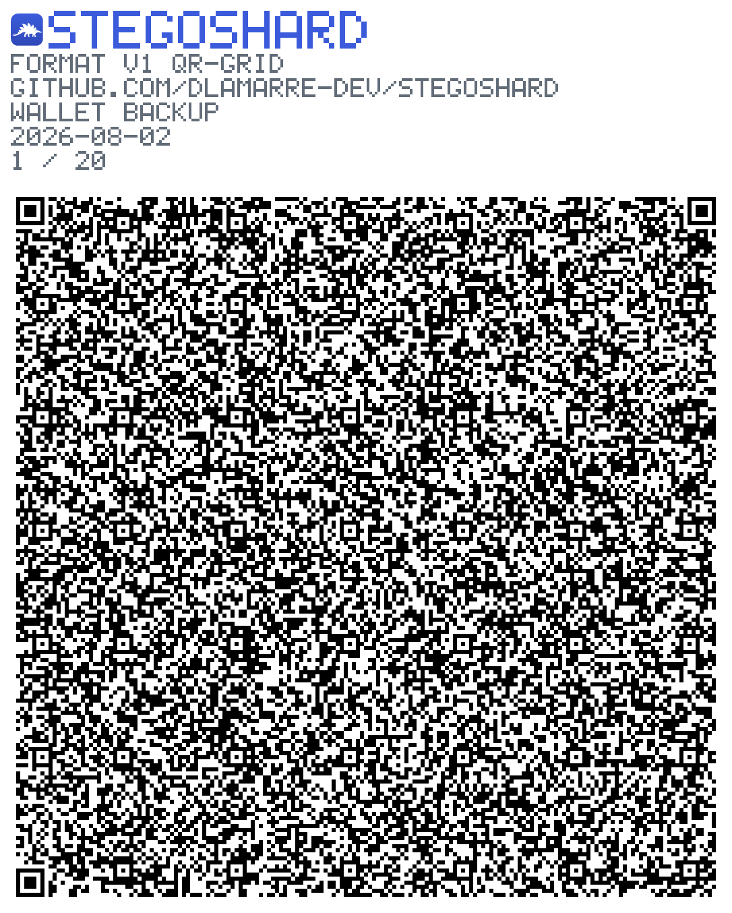
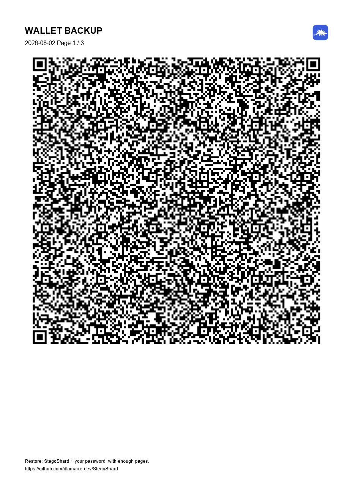

#  StegoShard

> **Store secrets in images: choose resilience, plausible deniability, or combine
> both.** A cross-browser WebExtension (Chrome, Edge, Firefox) for **small,
> high-value secrets**: password exports, keys, seed phrases, configs, `.env` files,
> notes.

StegoShard encrypts your file (zero-knowledge) and then gives you **two complementary
storage models**, plus a bridge between them. **Resilient Storage** keeps the secret
recoverable: openly artificial, error-corrected images that survive recompression and
printing, or a single opaque binary file for larger secrets. **Deniable Storage** hides
the secret so its very existence is deniable: fragmented inside ordinary-looking photos,
or wrapped as a decoy database that reads as a mundane `.db`. **Hybrid** combines the two:
store the archive resiliently and hide only the recovery key in an everyday photo.

> **Meet Alice.** She wants to back up her password-manager export and keep it for
> years, without a cloud company, or anyone glancing at her drive, knowing it exists.
> She picks **Hybrid mode**:
>
> - the encrypted archive becomes **six resilient images**, which she **prints** and files away;
> - the **recovery key** is hidden inside an ordinary **family photo** she leaves in Dropbox.
>
> Years later one printed page is lost and coffee has ruined another. It doesn't matter:
> **five pages plus the vacation photo** are enough, and she restores everything
> byte-for-byte. The photo looked like a photo the whole time.

```
StegoShard offers two complementary storage models, plus a bridge between them.

🛡  Resilient Storage   error-corrected images, or one opaque file · survives print and copy
🎭  Deniable Storage    inside ordinary photos, or a decoy database · hides that data exists
🔗  Hybrid              store the archive resiliently, hide only the recovery key in a photo
```

## Two storage models

Start from the question that actually matters for your secret:

```
                          StegoShard

                     Which property matters?

          ┌────────────────────┴────────────────────┐
          │                                         │
  It must survive                           Nobody must know
  everything                                it even exists
  (loss · print · copy)                     (plausible deniability)
          │                                         │
          ▼                                         ▼
  🛡 Resilient Storage                       🎭 Deniable Storage
          │                                         │
          └────────────────────┬────────────────────┘
                               ▼
                         🔗 Hybrid Mode
             (resilient archive + deniable recovery key)
```

These are **not two points on a continuum; they are two incompatible guarantees**,
and picking one is a deliberate trade-off:

| Model                   | Primary goal                   | Survives recompression | Plausible deniability |
| ----------------------- | ------------------------------ | :--------------------: | :-------------------: |
| 🛡 **Resilient Storage** | Reliable backup                |         ✅ Yes         |         ❌ No         |
| 🎭 **Deniable Storage** | Hide that the data even exists |         ❌ No          |        ✅ Yes         |

The more you optimize to survive transformations, the more detectable the carrier
becomes; the more you optimize for deniability, the more fragile the storage. This
isn't a bug: the deniable channel is **fragile by nature**, and StegoShard makes the
choice explicit instead of pretending one setting does both.

**🔗 Hybrid** bridges them. Store the encrypted archive resiliently (openly artificial
images), and hide **only the recovery key** in an ordinary photo:

```
Archive (≤ 1 GiB)
        │
        ▼
StegoShard: Resilient Storage
        │
        ├── resilient images (visibly artificial, tolerate recompression)
        │
        └── recovery key
                 │
                 ▼
         Ordinary photo: Deniable Storage
        (key hidden deniably, fragile by design)
```

If that photo is copied to a social network, recompression destroys the hidden key,
by design. The deniable channel is expendable; the resilient archive stays intact. Small
secrets (≈2 KB: seeds, keys, passwords) can live entirely in Deniable Storage on
their own.

### Output forms

The security goal is one axis; the **carrier** is another. Each model offers more than
one output form, so you pick both: what guarantee you want, and what the result looks
like on disk:

| Output form                                    |    Model    | What it is                                                                                                                                                                                                                                                                                                                                                   |
| ---------------------------------------------- | :---------: | ------------------------------------------------------------------------------------------------------------------------------------------------------------------------------------------------------------------------------------------------------------------------------------------------------------------------------------------------------------ |
| **Coded images** (disk / paper)                | 🛡 Resilient | Openly artificial images designed to tolerate recompression and printing. Digital output defaults to an **8-colour grid**, 3 bits per module instead of QR's ~0.75, so roughly a third as many files, with plain QR one click away, and always used for print. Either is restored automatically.                                                             |
| **Opaque binary file** (`.ssbn`)               | 🛡 Resilient | One compact file for larger secrets (up to 1 GiB in the CLI, 256 MiB in the browser; no image-count ceiling). Not deniable; clearly a StegoShard vault.                                                                                                                                                                                                      |
| **Decoy database** (`.db`)                     | 🎭 Deniable | The same binary bytes wrapped with a valid SQLite header, so file-type triage reads it as an ordinary database. Optional **duress** (a plausible decoy opens under a 2nd password) or **non-possession** (gated on threshold shares you don't hold) access modes (SPEC §10). Survives copying; deniability is shallow against a tool that actually opens it. |
| **Ordinary photos** (stego key / Gallery Mode) | 🎭 Deniable | The secret (or just the key) hidden inside real-looking photos. Blends in completely, but **fragile**: recompression destroys it. Also supports **non-possession** access mode (SPEC §10); duress mode is `.db`-only.                                                                                                                                        |

The binary file and decoy database are peers of the image output, not afterthoughts:
they are how you store a **larger** secret (up to 1 GiB), resiliently or deniably, when
the image count would otherwise be impractical.

### What the output looks like

The same 40 KB file, saved three ways. These are real artifacts straight out of the
pipeline; regenerate them with `npm run samples`.

<table>
  <tr>
    <td align="center" width="33%">
      
    </td>
    <td align="center" width="33%">
      
    </td>
    <td align="center" width="33%">
      
    </td>
  </tr>
  <tr>
    <td align="center"><b>Colour grid</b> · disk<br>7 images · 8636 B each · 704 px</td>
    <td align="center"><b>QR code</b> · anywhere<br>20 images · 2800 B each · 1086 px</td>
    <td align="center"><b>Printable PDF</b> · paper<br>one high-ECC QR per page<br>(<a href="docs/images/sample-paper.pdf">sample PDF</a>)</td>
  </tr>
</table>

Note the colour image is the _smaller_ picture of the two while holding three times as
much, which is why the same secret needs 7 files instead of 20. Both are restored the
same way; StegoShard reads either automatically, so the choice costs you nothing later.
Every image carries the mark, the format version, the codec name and the spec URL, so one
found years from now says what it is and where to go to read it.

## Quickstart

Three ways to use StegoShard; all run the **same `@core` format**, so a vault made with
one restores with any other (and with the [Python decoder](python/README.md)).

**1. Web app: no install, nothing leaves your device.** The fastest way to try it: the
offline core (Disk + Paper) runs entirely in your browser.

> ▶️ **[dlamarre-dev.github.io/StegoShard](https://dlamarre-dev.github.io/StegoShard/)**

Or run the same app from your own machine, with no site involved: `npx stegoshard ui`
prints a `http://127.0.0.1/…` address to open. The downloadable offline bundle carries a
`serve.mjs` that does the same for the folder it sits in. Both are needed rather than just
opening `index.html`, which no browser will run: ES modules and module workers are blocked
over `file://`. See [CLI.md](docs/CLI.md#the-same-app-in-a-browser-from-your-own-machine),
including what a browser records that the command line does not.

**2. Browser extension.** During beta, build it and load it unpacked (store listings are
pending, see [Status](#status)):

```bash
npm install
npm run build            # → dist/chrome/  (also: npm run build:firefox, build:edge)
```

Then `chrome://extensions` → Developer mode → **Load unpacked** → pick `dist/chrome/`
(Firefox: `about:debugging` → This Firefox → **Load Temporary Add-on** → its `manifest.json`).

**3. Command-line tool.** From a clone, no global install needed:

```bash
npm install
npm run cli -- save secret.txt --out ./vault      # → PNG images
npm run cli -- restore ./vault --out ./restored    # ← images / folder / .zip / .pdf
npm run cli -- ui                                  # or drive it from a browser, locally
```

See the [command-line reference](docs/CLI.md) for key modes, paper, binary, and Gallery Mode.
(A published `npm i -g stegoshard` and standalone binaries land with 1.0.)

## What it does

**Save (export)**

```
file → unlock (password → KEK → DEK) → compress → encrypt (AES-GCM)
     → erasure code (k data + m parity shards, Reed-Solomon)
     → render each shard as a resilient image (profile per destination)
     → disk (PNG/ZIP) | paper (printable PDF)
```

**Restore (import)**

```
import images (any source) → decode each (self-describing header → shard)
     → Reed-Solomon reconstruct (tolerates up to m missing/corrupt images)
     → unlock → decrypt → decompress → original file, byte-for-byte
```

The differentiator: **losing a page, a deleted album image, or an unreadable code does
not stop restoration** as long as at least `k` images survive.

**Bring your own entropy (optional, expert).** Every random value (salts, IVs, DEKs,
Shamir coefficients, decoy filler) comes from the platform CSPRNG
(`crypto.getRandomValues`). If you would rather not trust that alone, the expert save
options (and `--entropy` / `--entropy-file` / `--entropy-prompt` / `STEGOSHARD_ENTROPY` in
the CLI) let you add a string of your own: mash the keyboard, or type out dice rolls. It is
XORed into every draw **on top of** the CSPRNG, which is still used for every byte. The
extra layer can only add uncertainty, never replace it, so even a worthless string leaves
you exactly as safe as before. It affects generation only: nothing about it is stored, the
format is unchanged, and **restore never asks for it**.

It covers what the save itself generates. In the CLI and the web app that is everything,
key included. In the **browser extension** the vault key is minted once when you set up the
key store, so it predates any save. Entropy given at save time covers that save's salts,
IVs, nonces, key factors, shares and filler, but cannot reach back to the stored key. The
key-creation form therefore offers the same field, and that is the only moment the managed
key itself can be covered.

## Performance

Two costs are worth knowing about; both are deliberate, and neither is hidden from you.

**Key derivation** is the cost that protects you. Every unlock runs Argon2id at
**256 MiB, t=4** in the current pre-1.0 candidate. That slowness is deliberate: it makes
an offline password search more expensive. Budget roughly **256 MiB of transient memory**
for it. Actual latency and mobile viability vary by device and remain release-QA gates.

**Processing the secret** is effectively instant on the image/PDF path (capped at ≤ 1 MiB),
but it takes **real, visible time on the large binary path** (`.ssbn` / `.db`, up to
**256 MiB** in the browser or **1 GiB** in the CLI). There the file is gzip-compressed,
encrypted with a chunked authenticated cipher, and then decrypted once more to prove the
save round-trips _before_ you are told it succeeded; on a large file that is a few seconds
of work, not instant. So the work is made honest and non-blocking:

- In the **browser**, the binary encrypt/decrypt runs in a **Web Worker** (off the UI
  thread) with a **progress bar**, so the tab stays responsive instead of freezing.
- In the **CLI**, a **progress indicator** on stderr names each phase (suppress with
  `--quiet`).

It all runs **locally**, WebAssembly in the browser and the bundled runtime in the CLI,
with no application network round-trips. The hosted web build still depends on the web
host to deliver the reviewed files; the downloadable extension and CLI avoid that delivery trust.

## Design principles

- **Two incompatible guarantees, made explicit.** Resilience and deniability pull in
  opposite directions (see [Two storage models](#two-storage-models)). Resilient Storage
  looks like coded noise, not vacation photos, deliberately; Deniable Storage blends
  in but is fragile by nature. StegoShard makes you choose rather than pretending one
  setting does both, and documents the honest limits of each.
- **Small-to-medium secrets.** ~4× size overhead when stored as images (≤ 1 MiB there); the
  binary path takes up to 1 GiB (CLI) / 256 MiB (browser). Multi-gigabyte files are out of scope.
- **No single support is trusted.** Resilience (multiple destinations + erasure coding)
  is the value proposition.
- **The offline core (file → images/files → disk/paper) depends on no third-party
  service or network.** Public builds request no network or host permissions.
- **Auditable.** Open source (MIT), PR-gated, with a versioned format spec and a
  standalone Python reference decoder so your data survives even if the extension does not.

## Status

🧪 **Beta: under security and physical-recovery validation.** The major workflows are
built and cross-validated, but the compatibility and high-value-use promises remain
provisional until the external audit and release QA gates close.

**Complete and tested:**

- **Crypto core.** Argon2id KEK/DEK, AES-256-GCM, opportunistic gzip, Reed-Solomon
  erasure coding, the qr-grid and color-grid image codecs, and the self-describing header. The layer is
  documented for auditors in a [cryptographic review dossier](docs/CRYPTO-REVIEW.md)
  (claims → where enforced → which test proves it), with committed cross-implementation
  test vectors and exhaustive negative/fuzz testing.
- **Destinations** _(🛡 Resilient Storage)_. **Disk** (a set of PNG images, or a single
  `.zip`) and **Paper** (a printable PDF, one high-ECC QR per page, readable header +
  optional instruction sheet, restores from scans or photos).
- **Key modes.** **embedded** (key block travels in the images), **keyfile** (a separate
  `.key` file), and **deniable stego** _(🎭/🔗, the Deniable & Hybrid building block)_:
  the key hidden in an ordinary photo; a baseline JPEG cover stays a same-size JPEG via
  DCT-coefficient embedding, a PNG cover stays a PNG. Combined with a resilient destination
  this **is** Hybrid mode. Plus a **managed vault key** in the options page (create /
  unlock per session / change password / export / import / erase); the unlocked session
  is volatile and persists across popup reopens until the browser closes.
- **Non-image output.** A **binary container** for larger secrets (up to 1 GiB, no
  image-count ceiling): a compact opaque `.ssbn` file _(🛡 Resilient)_, or the same bytes
  wrapped as a **decoy database** with a valid SQLite header so file-type triage reads it
  as an ordinary `.db` _(🎭 Deniable)_ (SPEC §8). Plus **Gallery Mode** _(🎭 Deniable)_
  (SPEC §9), which fragments a small secret across a folder of ordinary photos plus
  decoys, Reed-Solomon-protected and decoded blindly.
- **Access structures** _(🎭 Deniable, SPEC §10)_. On `.db` and Gallery: **duress
  mode**, a plausible decoy payload that opens under a second, independent password
  while the real region stays unreachable from that credential (`.db` only); and
  **non-possession mode**, gating the real payload on Shamir _k_-of-_n_ threshold
  shares the writer never keeps, so "I cannot decrypt this" is literally true below
  threshold. Unlock follows a fixed candidate schedule and returns region-blind errors;
  this is an equal-control-flow design, not a formal side-channel proof.
- **Independent recovery.** A standalone **[Python reference decoder](python/README.md)**
  restores a vault without the extension and runs in CI as a cross-implementation
  conformance test, and a headless **CLI** (below) creates and restores the same format.
- **Localization.** The UI, privacy policy, and terms are localized into 8 languages
  (en, fr, it, de, es, pt, ja, zh_TW; see [docs/LOCALIZATION.md](docs/LOCALIZATION.md)),
  with native review still required for the locales listed in
  [docs/LOCALIZATION.md](docs/LOCALIZATION.md).

The current beta format candidate is documented in [SPEC.md](SPEC.md)
(`FORMAT_VERSION = 1`), but pre-1.0 compatibility is not promised until the external
audit and physical QA gates close. The
extension is packaged for the Chrome Web Store, Edge Add-ons, and Firefox
(`npm run package`); see [docs/STORE.md](docs/STORE.md) and the
[privacy policy](docs/PRIVACY.md).

**Required before a public 1.0:** close the independent security audit, complete the
documented browser/physical QA matrix, obtain the outstanding native reviews, and
freeze the resulting format and release artifacts.

## Development

Requires Node.js ≥ 20.

```bash
npm install
npm run typecheck   # tsc --noEmit
npm run lint        # eslint
npm test            # vitest
npm run build       # build the Chrome/Edge extension into dist/
npm run build:firefox
```

Each target builds into its own directory. There is also a **standalone web app** (the offline core, Disk + Paper, with no
install and nothing leaving your device), built with `npm run build:web` / `npm run
dev:web` and deployed to GitHub Pages. It doubles as an extension-independent recovery
tool.

## Documentation

| Doc                                                                                                    | What's in it                                                                                    |
| ------------------------------------------------------------------------------------------------------ | ----------------------------------------------------------------------------------------------- |
| [Why StegoShard?](docs/WHY.md)                                                                         | The problem, and the reasoning behind the two-model design.                                     |
| [Where it fits](docs/COMPARISON.md)                                                                    | Cited competitive map vs. seed backups, encrypted archives, VeraCrypt, and steganography tools. |
| [Command-line reference](docs/CLI.md)                                                                  | Full CLI: save/restore, key modes, paper, binary, Gallery Mode, packaging.                      |
| [Threat model](docs/THREAT-MODEL.md)                                                                   | Adversaries, what each model defends against, and the deliberate non-goals.                     |
| [Format specification](SPEC.md)                                                                        | The beta on-disk / on-image format candidate (`FORMAT_VERSION = 1`).                            |
| [Cryptographic review dossier](docs/CRYPTO-REVIEW.md)                                                  | Claims → where enforced → which test proves it, for auditors.                                   |
| [Claims register](docs/CLAIMS.md)                                                                      | Every security/resilience claim, its evidence, and the limits it does **not** cover.            |
| [Python reference decoder](python/README.md)                                                           | Restore a vault without the extension: install, CLI, and the library API.                       |
| [Release QA protocol](docs/QA.md)                                                                      | The physical capture matrix a release is signed off against (print, photo, scan).               |
| [Roadmap](docs/ROADMAP.md) · [Privacy](docs/PRIVACY.md) · [Terms](docs/TERMS.md)                       | Direction, privacy policy, terms of use.                                                        |
| [Localization](docs/LOCALIZATION.md) · [Store guide](docs/STORE.md) · [Versioning](docs/VERSIONING.md) | Translation setup, store submission, format-version policy.                                     |
| [Contributing](CONTRIBUTING.md) · [Security](SECURITY.md)                                              | How to contribute; how to report vulnerabilities.                                               |

## Contributing & security

See [CONTRIBUTING.md](CONTRIBUTING.md) and [SECURITY.md](SECURITY.md). All contributions
go through pull requests with required checks (lint, typecheck, tests, build). Please
report vulnerabilities privately via GitHub Security Advisories, never crypto in a
public issue.

## License

[MIT](LICENSE) for the current beta. The pre-1.0 licensing decision record is in
[docs/LICENSING.md](docs/LICENSING.md).
